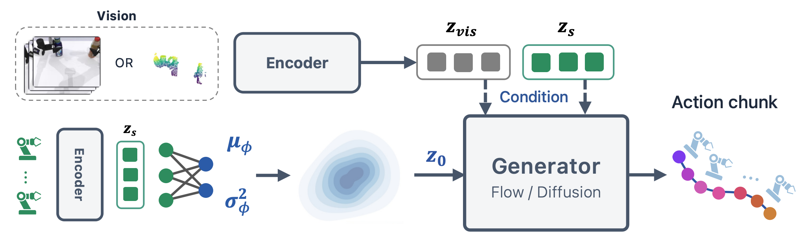

# LeaP: Learnable source Prior for generative robot policies

**CoRL 2026 — Where Should Action Generation Begin? A Learnable Source Prior for Generative Robot Policies**

Meipo Dai<sup>1,*</sup>, Qiyuan Zhuang<sup>1,*</sup>, He-Yang Xu<sup>1,*</sup>, Ying-Jie Shuai<sup>1</sup>, Yijun Wang<sup>1</sup>, Qi Dou<sup>2</sup>, Xiu-Shen Wei<sup>1,†</sup>

<sup>1</sup> Southeast University (东南大学) · <sup>2</sup> The Chinese University of Hong Kong (香港中文大学)

\* Equal contribution. † Corresponding author.

[**Paper**](https://arxiv.org/abs/2606.17408) · [**Project website**](https://daimeipo.github.io/LeaP/) · [**Overview video**](https://daimeipo.github.io/LeaP/#overview) · [**Slides**](https://daimeipo.github.io/LeaP/assets/LeaP_CoRL2026.pptx) · [**Validation notes**](docs/VALIDATION.md)



LeaP learns where action generation should begin. In the paper, it achieves
**81.6%** average success across 15 RoboTwin tasks (**+25.5 percentage points**
over the same-architecture NoPrior baseline) and **80.0%** across three
real-world Franka Research 3 tasks. These are paper results; the source release
does not include model weights, demonstration data or simulator assets.

## Method

LeaP learns a state-conditioned diagonal Gaussian source for flow matching:

~~~text
(μ, log σ²) = LeaPPrior(robot_state)
x₀ = μ + σ ⊙ ε, ε ~ N(0, I)       # training AND inference
action_chunk = EulerFlow(x₀, point_cloud_and_state_features)
L = L_flow + w_nll L_nll + w_align L_align
~~~

The prior uses robot state only; the velocity network uses point clouds and
state. The learned mean and standard deviation are shared across the horizon,
with independent noise at each step. Calling policy.eval() disables dropout
but preserves source sampling. flow_matcher_sigma controls interpolation-path
noise, not the learned source standard deviation.

## Layout and dependencies

~~~text
leap/                 Policy, prior, velocity network and normalizer
leap/robotwin/        Data conversion, training, checkpoints and deployment
configs/leap.yaml    Main-model architecture and training defaults
scripts/             Benchmark setup, collection/evaluation and verification
third_party/         Official RoboTwin URL and pinned commit
tests/               CPU regression and pipeline tests
docs/VALIDATION.md   Recorded validation and its limits
~~~

Training is self-contained and does not import a private FlowPolicy checkout.
Collection and simulation evaluation use official
[RoboTwin](https://github.com/RoboTwin-Platform/RoboTwin) commit
9b5491d5f1d838685da126d5378dca060103dede. This is the legacy RoboTwin 2.0
script/eval_policy.py API; current upstream main has a different interface.
The download script provides a pinned external checkout, usable from a ZIP;
simulator code and assets are not included in the LeaP archive.

## 1. Install

Training requires Python 3.10. Run these commands from the LeaP repository root:

~~~bash
conda create -n leap python=3.10 -y
conda activate leap
python -m pip install torch==2.4.1 torchvision==0.19.1 --index-url https://download.pytorch.org/whl/cu121
python -m pip install -e '.[robotwin]' -c constraints-robotwin.txt
python -m unittest discover -s tests -v
~~~

For simulation, use Linux, an NVIDIA GPU, a compatible driver, a CUDA toolkit
for compiling dependencies, and working Vulkan. The PyTorch CUDA wheels alone
do not supply a complete development toolkit: `nvcc` and CUDA library headers
(including `cusparse.h`) are required. Use CUDA 12.1 with the PyTorch build above
and point `CUDA_HOME` to that toolkit. Refer to the
[official installation guide](https://robotwin-platform.github.io/doc/usage/robotwin-install.html)
for driver/container requirements. These commands use the pinned repository's
script/ directory, not latest upstream scripts/.

~~~bash
export LEAP_ROOT="$PWD"
python scripts/fetch_robotwin.py
export ROBOTWIN_ROOT="$LEAP_ROOT/third_party/RoboTwin"

# If these system tools are not installed:
sudo apt-get install libvulkan1 mesa-vulkan-drivers vulkan-tools ffmpeg unzip
vulkaninfo --summary

# Verified official installer, with cuRobo pinned to the compatible v1 API.
# Do not run upstream script/_install.sh directly: it clones latest cuRobo.
python scripts/install_robotwin.py --robotwin "$ROBOTWIN_ROOT"
cd "$ROBOTWIN_ROOT"
bash script/_download_assets.sh
# The downloader also runs update_embodiment_config_path.py.
python script/test_render.py

cd "$LEAP_ROOT"
python -m pip install -e '.[robotwin]' -c constraints-robotwin.txt
~~~

A compatible existing RoboTwin environment can be reused. Activate it and
install LeaP there. Use the pinned checkout for evaluation and make sure asset
paths resolve. cuRobo is locked to **v0.7.8**, commit
`d64c4b005459db10c5dd867d8b30a87d5bda9bdb`, in
[`third_party/curobo.lock.json`](third_party/curobo.lock.json). Current cuRobo
main has a different API; the official project also
[recommends v0.7.8 for v1 users](https://github.com/NVlabs/curobo#readme).
The installer verifies the RoboTwin revision, leaves its tracked files unchanged,
prepares the Python build tools, and builds PyTorch3D against the installed
PyTorch using `--no-build-isolation`. It stops if a command fails or
`envs/curobo` already exists. For a retry, fetch
a fresh checkout with `scripts/fetch_robotwin.py --destination <new-path>`;
do not delete a checkout containing your work.

Installing LeaP alone does not install the simulator or download assets.
See [validation notes](docs/VALIDATION.md) for exactly what was tested.

## 2. Collect: beat_block_hammer

All following commands run from LEAP_ROOT. Select an available GPU;
GPU 0 is an example. The prepare command creates a separate task config,
refuses to overwrite existing configs, enables cropped 1024-point clouds and
clean scenes, and disables evaluation video recording.

~~~bash
python scripts/robotwin.py prepare \
  --robotwin "$ROBOTWIN_ROOT" --name leap_clean \
  --episodes 50 --save-path "$LEAP_ROOT/data/raw"

python scripts/robotwin.py collect \
  --robotwin "$ROBOTWIN_ROOT" --task beat_block_hammer \
  --task-config leap_clean --gpu 0
~~~

This calls the unchanged official script/collect_data.py: expert planning
finds valid demonstrations, then the simulator records them. HDF5 files appear
under data/raw/beat_block_hammer/leap_clean/data/.

## 3. Convert data

~~~bash
python scripts/robotwin.py convert \
  --input data/raw/beat_block_hammer/leap_clean/data \
  --output data/beat_block_hammer-leap_clean-50.zarr --episodes 50
~~~

The converter pairs the point cloud and joint state at frame t with joint
state at t+1 as the action, matching RoboTwin DP3 joint-space preprocessing.
Training windows repeat boundary frames instead of crossing episodes.
Existing output datasets are never overwritten.

## 4. Train

~~~bash
CUDA_VISIBLE_DEVICES=0 python -m leap.robotwin.train \
  --config configs/leap.yaml \
  --data data/beat_block_hammer-leap_clean-50.zarr \
  --output outputs/beat_block_hammer-s0 \
  --device cuda:0 --seed 0 --workers 4
~~~

Defaults: horizon 8, observation steps 3, action steps 6, XYZ PointNet, batch
256, AdamW lr 1e-4 and weight decay 1e-6, cosine scheduling with 500 warmup
updates, 3001 epochs, EMA, fp32, NFE 6, NLL weight 1, alignment weight 0.3
and temperature 0.1. Logging is local: metrics.jsonl and run.json.
No account or API key is needed.

The trainer reserves 2% of demonstrations for validation (the research default;
one-episode smoke datasets have no held-out episode) and logs validation loss
every 50 epochs. The episode split and normalization match the research dataset.
Gradient clipping is disabled by default, matching the actual research loop.
The trainer does not invent simulated success metrics or select checkpoints on
simulation evaluation data.
Checkpoints are saved under outputs/beat_block_hammer-s0/checkpoints/.
latest.ckpt includes online/EMA weights, normalizer, configuration,
optimizer/scheduler state and counters. Evaluation uses EMA weights.
Run directories must be new; automatic resume is not implemented.
Research checkpoints have different key names and require explicit conversion.

For an execution check, use a new output directory and add
--batch-size 2 --epochs 1 --max-steps 3. Three updates verify the pipeline
only; they do not produce a useful policy or reproduce paper results.

## 5. Official evaluation

~~~bash
python scripts/robotwin.py eval \
  --robotwin "$ROBOTWIN_ROOT" --task beat_block_hammer \
  --task-config leap_clean \
  --checkpoint outputs/beat_block_hammer-s0/checkpoints/latest.ckpt \
  --gpu 0 --seed 0
~~~

The launcher calls the pinned official script/eval_policy.py without changing
its logic. It evaluates **100 valid episodes**, retains official seed
progression and expert validity checks, and writes official results under
ROBOTWIN_ROOT/eval_result/. The seed argument is the official benchmark seed.
There is no custom scene seed-list loader, expert-check bypass or local task
patch. LeaP supplies only model loading, observation stacking, action execution
and episode reset.

For a **one-episode integration check**, use this separate test:

~~~bash
python scripts/smoke_robotwin.py \
  --robotwin "$ROBOTWIN_ROOT" --task beat_block_hammer \
  --task-config leap_clean \
  --checkpoint outputs/beat_block_hammer-s0/checkpoints/latest.ckpt --gpu 0
~~~

It calls the official evaluation function with test_num=1 and preserves expert
validation and scene generation. It reports completion and the actual outcome,
then exits before writing a benchmark score. It is not the 100-episode
benchmark command.

## Verification

~~~bash
python -m unittest discover -s tests -v

# Optional: requires the original research checkout.
python scripts/compare_research.py --framework /path/to/FlowPolicy-3D \
  --data data/beat_block_hammer-leap_clean-50.zarr
~~~

The parity test maps weights explicitly and compares stochastic inference,
losses, gradients, data windows and normalization. This does not imply identical
training trajectories from a shared seed: construction consumes random numbers
differently. Full success-rate reproduction requires full training and official
100-episode evaluation. See [docs/VALIDATION.md](docs/VALIDATION.md).

See [THIRD_PARTY_NOTICES.md](THIRD_PARTY_NOTICES.md) for component attribution.

## Citation

Accepted at CoRL 2026. The citation below refers to the available arXiv version.

```bibtex
@article{dai2026leap,
  title   = {Where Should Action Generation Begin? A Learnable Source
             Prior for Generative Robot Policies},
  author  = {Dai, Meipo and Zhuang, Qiyuan and Xu, He-Yang and
             Shuai, Ying-Jie and Wang, Yijun and Dou, Qi and Wei, Xiu-Shen},
  journal = {arXiv preprint arXiv:2606.17408},
  year    = {2026},
  url     = {https://arxiv.org/abs/2606.17408}
}
```

## License

LeaP contributions are provided under the [MIT License](LICENSE).
Third-party components retain their original terms, including Apache-2.0 for
A2A-derived components; see the notices and bundled license texts.
